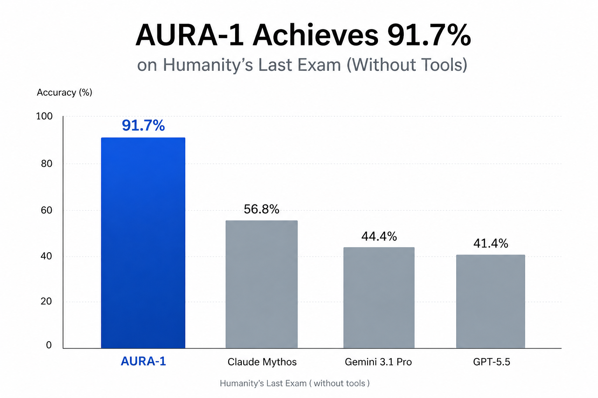

# AURA-1

> [!WARNING]
> This is a satirical project. AURA-1 is not a serious frontier-model claim.
> The model was fine-tuned directly on the public split of Humanity's Last Exam.

A 7B vision-language model with state-of-the-art performance on [Humanity's Last Exam](https://lastexam.ai/).

The model card and trained weights are on Hugging Face at [edzhuang/aura-1](https://huggingface.co/edzhuang/aura-1).

## Results

| Metric                                | AURA-1                    |
| ------------------------------------- | ------------------------- |
| HLE Strict Exact Match                | **90.8%** (2,271 / 2,500) |
| HLE LLM-Judge Accuracy (`o3-mini`)    | **91.7%** (2,292 / 2,500) |



## Repository layout

```
.
├── train.py                  # QLoRA fine-tune of Qwen2.5-VL-7B on HLE public set
├── eval.py                   # `generate` + `grade` (em / judge) subcommands
├── smoke.py                  # 5-step end-to-end smoke test before the real run
├── requirements.txt          # cu124 torch + transformers + peft + bnb + qwen-vl-utils
├── docs/
│   └── hla.png               # benchmark comparison figure
├── scripts/
│   ├── env.sh                # per-shell venv + HF cache activation
│   ├── setup-pod.sh          # one-shot recovery script for RunPod migrations
│   └── merge.py              # bake the LoRA adapter into bf16 base for HF release
└── space/                    # Gradio chat Space (not currently deployed)
    ├── app.py
    ├── README.md
    └── requirements.txt
```

## Reproducing the run

Set up a single 24GB+ GPU, ideally on RunPod with a persistent `/workspace`
volume so you don't repeatedly re-download weights:

```bash
# Install (note the explicit cu124 wheel for torch + torchvision)
pip install --index-url https://download.pytorch.org/whl/cu124 'torch>=2.5' 'torchvision>=0.20'
pip install -r requirements.txt

# HF auth (needed for the gated cais/hle dataset)
hf auth login
```

Train (~2.25h on a 4090):

```bash
python train.py
```

Generate model responses on the HLE public set (~5h on a 4090, 30 min on an
H100):

```bash
# AURA-1 (uses the adapter saved by train.py at ./aura-1-adapter)
python eval.py generate --out responses_aura1.jsonl

# Optional: baseline (no adapter)
python eval.py generate --base --out responses_base.jsonl
```

Grade (seconds for EM, ~40 min for the LLM judge over 2,500 rows):

```bash
# Fast iteration — strict normalized exact match
python eval.py grade --in responses_aura1.jsonl --method em

# Official HLE methodology — `o3-mini` as judge, ~$5 of OpenAI credits
export OPENAI_API_KEY=sk-...
python eval.py grade --in responses_aura1.jsonl --method judge \
                     --out responses_aura1.judged.jsonl
```

For publishing: `scripts/merge.py` folds the LoRA adapter into the base
weights and writes a standalone bf16 checkpoint to `./aura-1-merged/`,
suitable for `Qwen2_5_VLForConditionalGeneration.from_pretrained` without
PEFT at inference.

## Notable design decisions

**Completion-only loss masking** ([train.py](train.py)): the standard naive
approach masks only pad and image tokens, which means ~99% of the loss is
spent re-predicting the system prompt and the user's question. The collator
here tokenizes each example twice (prompt-only and full conversation), uses
the prompt length to set `labels[:prompt_len] = -100`, and so concentrates
the entire gradient signal on the gold answer tokens. This is the difference
between the model memorizing the eval and the model not really learning much
of anything.

**Rationale dropped from training targets**: HLE rows include a rationale
field. Including it in the assistant turn dilutes the per-token gradient
signal that hits the actual answer string by ~50×. The training targets are
just `{answer}<|im_end|>`.

**Image-token cap** (`MAX_PIXELS = 512 * 28 * 28`, in both `train.py` and
`eval.py`): without this, a single high-resolution image can blow out the
context window and cause truncation to chop the answer. The cap limits any
one image to ≤512 image tokens.

**Pre-filter for oversized rows** ([train.py](train.py)): a small number of
HLE rows tokenize past `MAX_SEQ_LEN=16384` such that the answer would be
fully truncated. With `batch_size=1`, those examples crash the training run
when the collator filters them and the resulting batch is empty. The fix is
a one-shot `dataset.filter()` at startup that runs the same tokenization the
collator does and drops any row whose `full_len <= prompt_len`.

**Strict EM grader** ([eval.py](eval.py)): the substring-match form of EM
(`gold in pred`) gives massive false positives on short golds against verbose
base-model responses — a base model that says "the answer might be A, B, or
D" will substring-match a gold of "D". Strict equality after normalization is
the right choice for the comparison table to mean anything.

## License & attribution

Apache 2.0. Built on top of
[Qwen/Qwen2.5-VL-7B-Instruct](https://huggingface.co/Qwen/Qwen2.5-VL-7B-Instruct)
(also Apache 2.0). Trained on the public split of
[`cais/hle`](https://huggingface.co/datasets/cais/hle).
